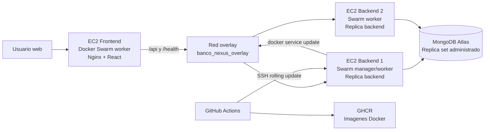

# Documento de Arquitectura - Banco Nexus

## Objetivo

Banco Nexus simula una aplicacion bancaria enfocada en transferencias monetarias
seguras. La solucion usa un backend monolitico contenedorizado, un frontend
independiente y persistencia administrada en MongoDB Atlas.

## Topologia AWS

## Componentes

- Frontend: React/Vite servido por Nginx en un contenedor dedicado. Nginx
  reenvia `/api` y `/health` al servicio backend dentro de la red overlay.
- Backend: Node.js/Express monolitico con autenticacion JWT, generacion de
  cuentas, beneficiarios, motor de transferencias y auditoria.
- Base de datos: MongoDB Atlas, con datos persistentes fuera de las instancias
  EC2 y de los contenedores.
- Orquestacion: Docker Swarm con dos replicas del backend y rolling update. El
  backend usa `stop-first` para respetar `max_replicas_per_node: 1` y mantener
  una replica por nodo; el frontend usa `start-first` en su nodo dedicado.

## Seguridad y consistencia

- Las contrasenas se guardan con hash `bcrypt`.
- El numero de cuenta se genera una sola vez y se marca como inmutable.
- La cuenta destino se valida con `/^\d{10}$/` antes de consultar la base.
- Las transferencias usan sesiones de MongoDB y `withTransaction` para aplicar
  cargo, abono, movimientos y auditoria de forma atomica.
- La bitacora registra accion, estado, usuario, cuenta, fecha y detalle.

## Despliegue

1. Inicializar Swarm en la EC2 manager y unir dos workers.
2. Crear los secretos `mongo_uri` y `jwt_secret`.
3. Publicar imagenes `backend` y `frontend` en GHCR.
4. Ejecutar `docker stack deploy -c deploy/swarm-stack.yml banco_nexus`.
5. En cada push a `main`, GitHub Actions compila, publica imagenes y ejecuta
   `docker service update` sobre los servicios del stack con despliegue
   progresivo.

## Infraestructura como codigo

La plantilla `infra/aws/cloudformation.yml` crea la VPC, subredes, security
group y las tres EC2 requeridas. Despues, `scripts/bootstrap-swarm.sh`
inicializa Docker Swarm y etiqueta los nodos:

- `banco_role=backend` para las dos EC2 de backend.
- `banco_role=frontend` para la EC2 dedicada de frontend.

El archivo `deploy/swarm-stack.yml` usa estas etiquetas para forzar que las dos
replicas del backend se distribuyan en los dos nodos backend y que el frontend
solo corra en la instancia dedicada.
