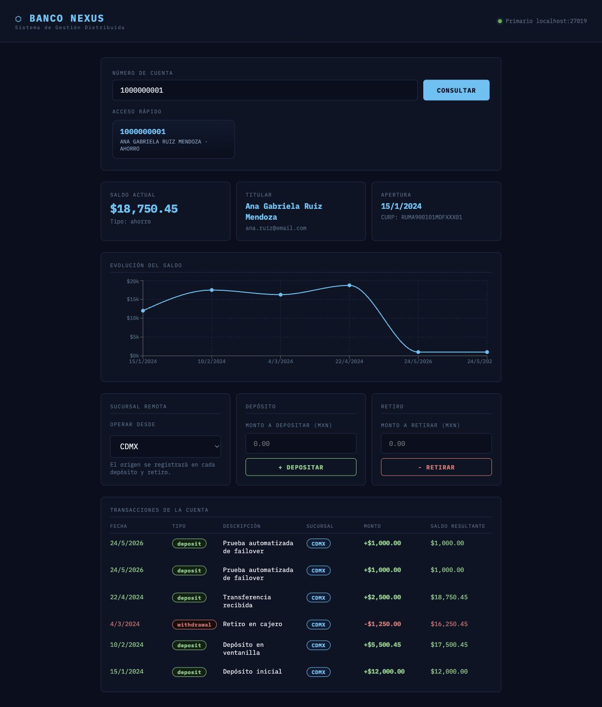

# Banco Nexus - Etapa 3: Replica Set MongoDB

## Objetivo De La Etapa

Configurar una replica local de MongoDB para Banco Nexus usando un Replica Set llamado `rsBanco`, con tres nodos disponibles en los puertos `27017`, `27018` y `27019`.

La finalidad es comprobar que el sistema puede mantener disponibilidad y consistencia de datos cuando el nodo primario cambia o falla temporalmente.

## Arquitectura Implementada

El proyecto usa Docker para evitar instalar MongoDB directamente en la computadora. En Docker Desktop se muestra un solo contenedor porque el servicio `mongo-rs` ejecuta tres procesos `mongod` dentro del mismo contenedor.

Cada proceso representa un nodo del Replica Set:

| Nodo | Host | Puerto | Rol esperado |
| --- | --- | --- | --- |
| Nodo 1 | `localhost` | `27017` | PRIMARY o SECONDARY |
| Nodo 2 | `localhost` | `27018` | PRIMARY o SECONDARY |
| Nodo 3 | `localhost` | `27019` | PRIMARY o SECONDARY |

La aplicacion se conecta usando la URI:

```text
mongodb://localhost:27017,localhost:27018,localhost:27019/banco_nexus?replicaSet=rsBanco
```

Esto permite que el driver de MongoDB detecte automaticamente cual nodo es el primario y continue trabajando aunque haya una nueva eleccion.

## Archivos Relevantes

| Archivo | Proposito |
| --- | --- |
| `docker-compose.yml` | Levanta el contenedor Mongo con los tres procesos `mongod`. |
| `backend/scripts/initializeReplicaSet.js` | Inicializa el Replica Set `rsBanco`. |
| `backend/scripts/failoverTest.js` | Prueba escritura con mayoria y lectura desde secundarios. |
| `backend/scripts/stepDownPrimary.js` | Degrada el primario actual para forzar una nueva eleccion. |
| `backend/src/db.js` | Configura la conexion Node.js/Mongoose con URI de Replica Set. |
| `backend/src/app.js` | Expone `/health` y rutas de cuentas/transacciones. |
| `frontend/src/App.jsx` | Muestra alertas de estado del Replica Set y operaciones desde UI. |

## Procedimiento Paso A Paso

### 1. Instalar dependencias

```bash
make backend-install
make frontend-install
```

### 2. Levantar MongoDB Replica Set con Docker

```bash
make db-replica-start
```

Evidencia:

```text
NAME                   IMAGE     COMMAND                  SERVICE    CREATED       STATUS       PORTS
banco_nexus_mongo_rs   mongo:7   "docker-entrypoint.s..." mongo-rs   9 hours ago   Up 9 hours   0.0.0.0:27017-27019->27017-27019/tcp
```

Archivo completo: `docs/evidence/etapa-3/03-docker-compose-ps.txt`

### 3. Inicializar el Replica Set

```bash
make db-replica-init
```

Evidencia resumida de `rs.status()`:

```text
Replica set rsBanco ya estaba inicializado.

name: 'localhost:27017'
health: 1
stateStr: 'SECONDARY'

name: 'localhost:27018'
health: 1
stateStr: 'PRIMARY'

name: 'localhost:27019'
health: 1
stateStr: 'SECONDARY'
```

Archivo completo: `docs/evidence/etapa-3/02-db-replica-init.txt`

### 4. Cargar datos iniciales

```bash
make db-seed
```

Evidencia:

```text
Banco Nexus seed completed.
Clientes insertados: 15
Cuentas insertadas: 15
Transacciones insertadas: 19

Cuentas de prueba:
  1000000001 | Ana Gabriela Ruiz Mendoza              | $18750.45
  1000000002 | Luis Alberto Perez Torres              | $32400.00
  1000000003 | Maria Fernanda Lopez Garcia            | $12890.75
```

Archivo completo: `docs/evidence/etapa-3/04-db-seed.txt`

### 5. Levantar backend y frontend

Terminal 1:

```bash
make backend-start
```

Terminal 2:

```bash
make frontend-start
```

URLs:

```text
Backend:  http://localhost:3001
Frontend: http://localhost:5173
```

## Evidencias De Funcionamiento

### Health Check Del Replica Set

Comando:

```bash
curl http://localhost:3001/health
```

Evidencia:

```json
{
  "status": "OK",
  "dbName": "banco_nexus",
  "replicaSet": "rsBanco",
  "readyState": "conectado",
  "primary": "localhost:27018",
  "isWritablePrimary": true,
  "latencyMs": 2,
  "members": [
    {
      "name": "localhost:27017",
      "stateStr": "SECONDARY",
      "health": 1
    },
    {
      "name": "localhost:27018",
      "stateStr": "PRIMARY",
      "health": 1
    },
    {
      "name": "localhost:27019",
      "stateStr": "SECONDARY",
      "health": 1
    }
  ]
}
```

Archivo completo: `docs/evidence/etapa-3/05-api-health.json`

### Consulta De Cuenta Desde API

Comando:

```bash
curl http://localhost:3001/api/accounts/1000000001
```

Evidencia:

```json
{
  "accountNumber": "1000000001",
  "accountType": "ahorro",
  "balance": 18750.45,
  "active": true,
  "client": {
    "name": "Ana Gabriela Ruiz Mendoza",
    "curp": "RUMA900101MDFXXX01",
    "email": "ana.ruiz@email.com",
    "phone": "5551001001"
  },
  "transactions": [
    {
      "type": "deposit",
      "amount": 2500,
      "resultingBalance": 18750.45,
      "branch": "CDMX"
    }
  ]
}
```

Archivo completo: `docs/evidence/etapa-3/06-api-account.json`

### Captura De La Interfaz

La interfaz muestra:

- Estado del Replica Set en la parte superior.
- Cuenta `1000000001` cargada.
- Saldo actual.
- Historial de transacciones.
- Panel de deposito/retiro por sucursal.



Archivo de imagen: `docs/evidence/etapa-3/10-ui-account.png`

## Prueba Automatizada De Failover

### Antes De Cambiar El Primario

Comando:

```bash
make db-replica-failover
```

Evidencia:

```text
Estado del Replica Set:
localhost:27017 | Estado: SECONDARY | health: 1
localhost:27018 | Estado: PRIMARY | health: 1
localhost:27019 | Estado: SECONDARY | health: 1

Nodo actual: localhost:27018
Primario detectado: localhost:27018
Puede escribir: true

Transaccion insertada con mayoria: 6a13c369837155373e9c4bde
localhost:27017 | lectura secundaria OK | transactions: 20
localhost:27019 | lectura secundaria OK | transactions: 20
```

Archivo completo: `docs/evidence/etapa-3/07-failover-before-stepdown.txt`

### Cambio De Primario

Comando:

```bash
make db-replica-stepdown
```

Evidencia:

```text
Degradando primario actual: localhost:27018
Primario degradado por 60 segundos.
```

Archivo completo: `docs/evidence/etapa-3/08-stepdown-primary.txt`

### Despues Del Cambio De Primario

Comando:

```bash
make db-replica-failover
```

Evidencia:

```text
Estado del Replica Set:
localhost:27017 | Estado: SECONDARY | health: 1
localhost:27018 | Estado: SECONDARY | health: 1
localhost:27019 | Estado: PRIMARY | health: 1

Nodo actual: localhost:27019
Primario detectado: localhost:27019
Puede escribir: true

Transaccion insertada con mayoria: 6a13c38d66f0687f975bd7ce
localhost:27017 | lectura secundaria OK | transactions: 21
localhost:27018 | lectura secundaria OK | transactions: 21
```

Archivo completo: `docs/evidence/etapa-3/09-failover-after-stepdown.txt`

## Interpretacion De Resultados

La prueba demuestra que:

- El Replica Set `rsBanco` tiene 3 nodos activos.
- Existe exactamente un nodo `PRIMARY`.
- Los otros dos nodos permanecen como `SECONDARY`.
- La aplicacion puede escribir usando `writeConcern: majority`.
- Las lecturas desde secundarios funcionan correctamente.
- Al degradar el primario con `stepDown`, MongoDB elige un nuevo primario.
- Despues del cambio de primario, el sistema sigue permitiendo lectura y escritura sin cambiar la configuracion del backend.

## Como Presentarlo En Clase

Orden recomendado para la demostracion:

1. Mostrar `docker compose ps` para explicar que hay un contenedor con 3 puertos publicados.
2. Ejecutar `make db-replica-init` y senalar los 3 miembros del Replica Set.
3. Ejecutar `make db-seed` para mostrar datos iniciales.
4. Abrir `http://localhost:5173` y buscar la cuenta `1000000001`.
5. Ejecutar `make db-replica-failover`.
6. Ejecutar `make db-replica-stepdown`.
7. Volver a ejecutar `make db-replica-failover` y mostrar que cambio el `PRIMARY`.
8. Explicar que el backend usa la URI con los tres nodos, por eso no depende de un puerto fijo.

## Conclusiones

La etapa 3 queda implementada correctamente porque Banco Nexus trabaja con una conexion a MongoDB Replica Set, mantiene disponibilidad ante cambio de primario y valida consistencia usando escritura con mayoria y lectura desde secundarios.

El uso de Docker simplifica el entorno de ejecucion y evita depender de instalaciones locales de `mongod` o `mongosh`.
